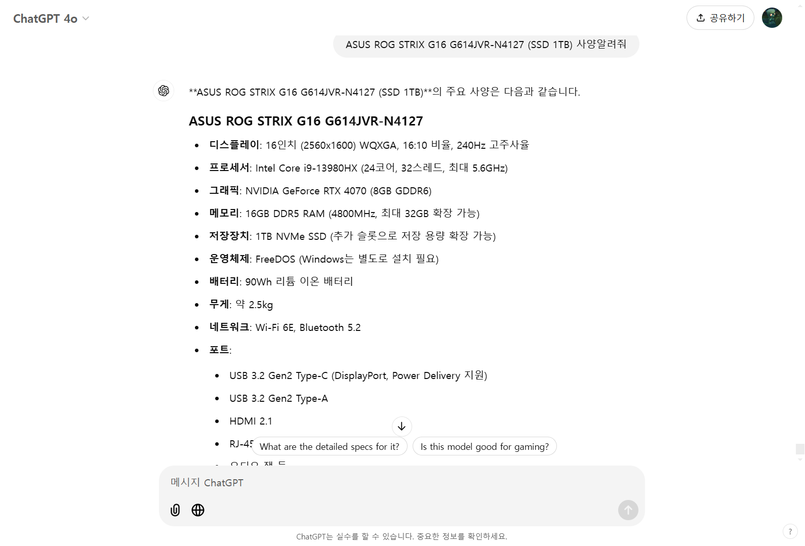
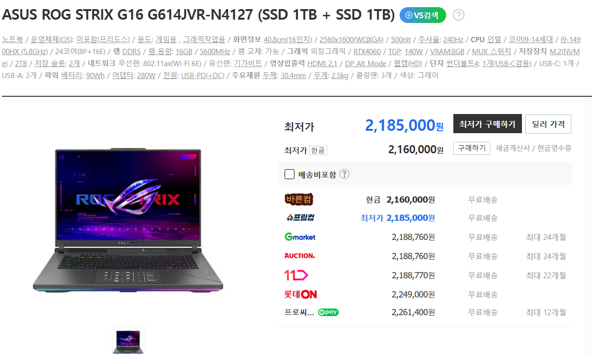
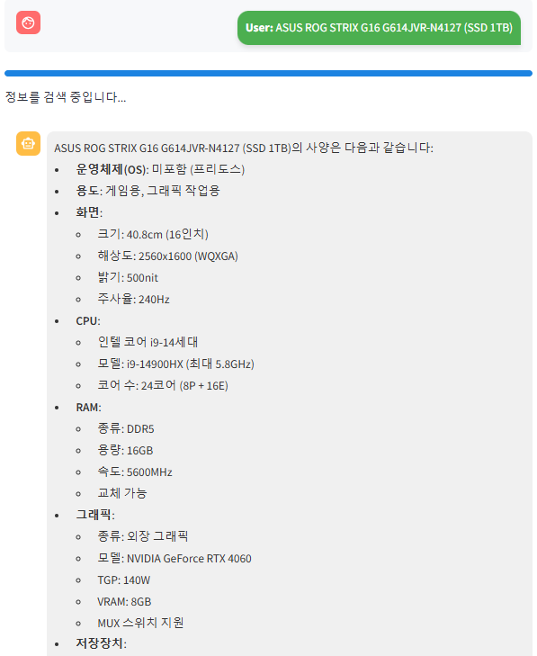

# 🤗 팀명 : 병헌이 구른다
 
### 🤭 팀원

<p align="center">
  <table>
    <tr>
      <td align="center">
        <br>김정훈 [팀장]
      </td>
      <td align="center">
        <br>김효은
      </td>
      <td align="center">
        <br>박병헌
      </td>
      <td align="center">
        <br>오종수
      </td>
      <td align="center">
        <br>이지수
      </td>
    </tr>
  </table>
</p>

### 💼 역할 분담

### 👨‍💻 김정훈
- **데이터 전처리**: 원본 데이터를 분석하고, 모델에 적합한 형태로 변환했습니다.
- **Retriever 구성**: FAISS 기반의 문서 검색기를 구성했습니다.
- **Prompt 작성**: 사용자의 질문에 대한 적절한 답변을 생성하기 위한 프롬프트를 설계했습니다.
- **Streamlit 페이지 구성 및 리드미 작성**: Streamlit을 활용한 웹 인터페이스 구현 및 프로젝트 리드미를 작성했습니다.

### 👨‍💻 박병헌
- **데이터 전처리**: 데이터를 정리하고, 분석에 필요한 형식으로 준비했습니다.
- **Retriever 구성**: 문서 검색을 위한 FAISS 기반 검색기를 구성했습니다.

### 👩‍💻 이지수
- **데이터 전처리**: 데이터 분석 및 클렌징 작업을 진행했습니다.
- **Retriever 구성**: FAISS로 데이터를 효과적으로 검색할 수 있도록 구현했습니다.
- **Prompt 작성**: 사용자의 질문에 적합한 응답을 도출하기 위한 프롬프트를 작성했습니다.

### 👨‍💻 오종수
- **Streamlit 페이지 구성**: 사용자와의 인터페이스 역할을 하는 웹 페이지를 구현했습니다.
- **리드미 작성**: 프로젝트 진행 방식, 각 구성 요소 설명 등을 포함한 리드미를 작성했습니다.

---

## 프로젝트 개요
**문제정의 : 할루시네이션 없는 컴퓨터 비교 챗봇을 만들고 싶다**
ChatGPT에게 노트북 추천을 요청하면 할루시네이션이 있는 내용을 계속 출력하여 사용자에게 필요한 정보를 제공 받지 못하는 점이 이 프로젝트의 주요 이슈였습니다.

예시) "https://cdn.discordapp.com/attachments/1305355347958956047/1306139608098017312/image.png?ex=673594cd&is=6734434d&hm=73bf6d5423451d7ccc5ccbc9f945ae937e9ccce64a6a991e57007ba347544976&"


이 프로젝트는 다나와 사이트에서 노트북 제품 정보를 **크롤링**하여, 사용자가 입력하는 질문에 대해 적절한 답변을 제공하는 **대화형 챗봇** 시스템을 구축하는 것입니다.
본 시스템은 **RAG(Retrieval-Augmented Generation)** 방법론을 기반으로 하여, 실시간으로 사용자가 원하는 제품 정보를 정확하게 제공할 수 있도록 설계되었습니다.

---

## 진행 과정

<p>
  
</p>
<p>사진 1</p>

<p>
  
</p>
<p>사진 2</p>

사진 1과 사진 2는 다른 모델에게 노트북 추천을 부탁했을 때 할루시네이션이 발생한 사례입니다.

<p>
  
</p>

저희가 만든 모델은 노트북에 대한 질문에 대해 할루시네이션 없이 정확한 정보를 제공하는 것을 확인할 수 있습니다.

## 기술 스텍

| Data Modeling | Front-End |
|--------------------|---------------------|
|    | 

<br><br>

---
## 폴더트리
```

│  .env
│  .gitignore
│  laptops_data.csv
│  main.py
│  README.md
│  streamlit.py
│
├─crawlingAndVectorDB
│      crawling.py
│      csvToFaiss.py
│
├─data
│  ├─csv
│  │      all_laptop_data.csv
│  │
│  └─db
│          faiss_index.faiss
│          faiss_index.pkl
│
├─db
├─RAG
│      prompt.py
│      retrieval.py
│
└─_
```

